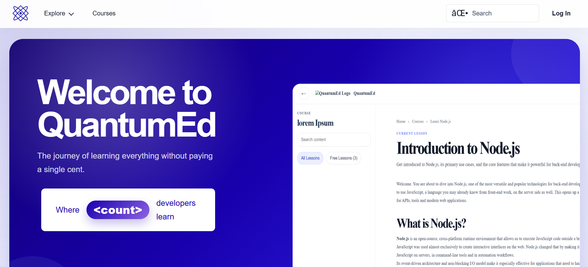
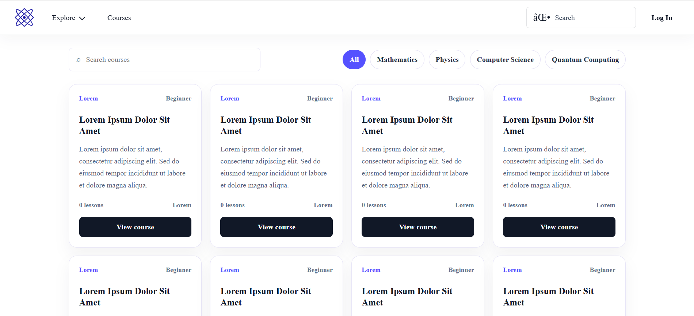
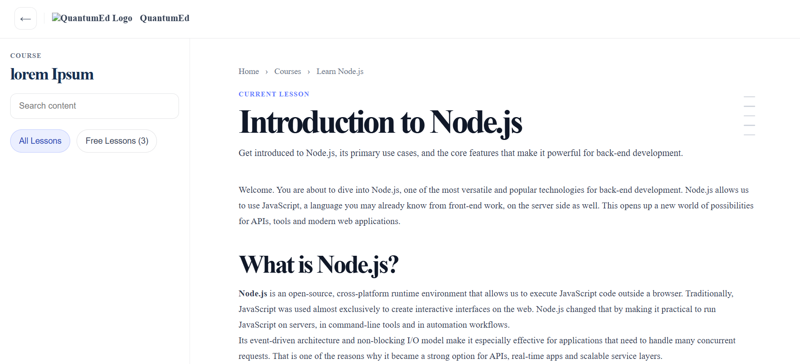

# QuantumEd

QuantumEd e uma plataforma educacional full stack para organizar cursos, modulos e aulas de temas tecnicos como computacao, ciencia, engenharia e fundamentos de fisica/quantum. O projeto combina uma interface React com uma API Express, autenticacao JWT e persistencia em PostgreSQL via Prisma.



## Sumario

- [Sobre o projeto](#sobre-o-projeto)
- [Screenshots](#screenshots)
- [Funcionalidades](#funcionalidades)
- [Tecnologias](#tecnologias)
- [Arquitetura](#arquitetura)
- [Como executar](#como-executar)
- [Variaveis de ambiente](#variaveis-de-ambiente)
- [Scripts disponiveis](#scripts-disponiveis)
- [API](#api)
- [Estrutura de pastas](#estrutura-de-pastas)
- [Status do projeto](#status-do-projeto)

## Sobre o projeto

O QuantumEd foi criado como um ambiente de aprendizagem gratuito e estruturado. A aplicacao web apresenta paginas de home, listagem de cursos, detalhes de curso e visualizacao de aulas. No backend, a API centraliza usuarios, autenticacao, papeis de acesso e o modelo de dominio para trilhas de estudo.

O objetivo do projeto e oferecer uma base evolutiva para:

- publicacao de cursos organizados por assunto, topico, modulo e aula;
- acompanhamento de progresso por usuario;
- autenticacao com cadastro, login e verificacao de token;
- separacao clara entre frontend, backend e tipos compartilhados.

## Screenshots

### Pagina inicial


### Listagem de cursos



### Visualizador de aulas



## Funcionalidades

- Home page com proposta da plataforma, areas de estudo e destaques.
- Listagem de cursos com filtros e cards.
- Pagina de detalhes do curso com hero, metadados, objetivos e conteudo.
- Visualizador de aulas com navegacao lateral e conteudo principal.
- API REST para usuarios.
- Autenticacao com signup, signin e verificacao de access token.
- Protecao de rotas privadas por middleware JWT.
- Modelagem Prisma para usuarios, cursos, modulos, aulas, conteudos e progresso.
- Tipos compartilhados entre `api` e `app` via pacote local.
- Ambiente conteinerizado com Docker Compose.

## Tecnologias

### Frontend

- React 19
- React Router DOM 7
- Vite 8
- TypeScript
- ESLint
- CSS modularizado por contexto de pagina/componente

### Backend

- Node.js
- Express 5
- TypeScript
- Prisma 7
- PostgreSQL 15
- JWT
- bcrypt
- CORS

### Infraestrutura

- Docker
- Docker Compose
- Pacote local de tipos em `packages/shared/types`

## Arquitetura

```text
React/Vite App
    |
    | HTTP
    v
Express API
    |
    | Prisma Client
    v
PostgreSQL
```

O frontend fica em `app/`, a API em `api/` e os contratos TypeScript compartilhados ficam em `packages/shared/types/`. A API usa Prisma para acessar o banco e expoe rotas REST para autenticacao e usuarios.

## Como executar

### Pre-requisitos

- Node.js 20+
- npm
- Docker e Docker Compose, caso utilize o ambiente conteinerizado
- PostgreSQL local, caso execute a API sem Docker

### Executando com Docker Compose

1. Crie os arquivos de ambiente indicados em [Variaveis de ambiente](#variaveis-de-ambiente).
2. Suba os servicos:

```bash
docker compose up --build
```

3. Acesse:

- Frontend: `http://localhost:3001`
- API: `http://localhost:3000`
- PostgreSQL: `localhost:5433`

### Executando localmente

Instale as dependencias da API:

```bash
cd api
npm install
```

Instale as dependencias do frontend:

```bash
cd ../app
npm install
```

Configure o banco e aplique as migrations:

```bash
cd ../api
npx prisma migrate dev
```

Inicie a API:

```bash
npm run dev
```

Em outro terminal, inicie o frontend:

```bash
cd app
npm run dev
```

Por padrao:

- API: `http://localhost:3000`
- Frontend Vite: `http://localhost:5173`

## Variaveis de ambiente

O `docker-compose.yml` referencia:

- `./app/.env`
- `./api/src/config/.env`

Para executar a API localmente a partir da pasta `api/`, crie tambem um `api/.env` com as mesmas variaveis, ou exporte essas variaveis no terminal antes de iniciar o servidor.

Exemplo para `api/src/config/.env` no Docker:

```env
PORT=3000
DATABASE_URL="postgresql://quantum:quantum@db:5432/quantum_ed?schema=public"
POSTGRES_USER=quantum
POSTGRES_PASSWORD=quantum
POSTGRES_DB=quantum_ed
POSTGRES_PORT=5432
JWT_SECRET=replace-with-a-secure-secret
JWT_EXPIRES_IN=1d
CORS_ORIGINS=http://localhost:3001,http://localhost:5173
NODE_ENV=development
```

Para execucao local sem Docker, use as mesmas variaveis em `api/.env` e ajuste o host do `DATABASE_URL` para o host do seu PostgreSQL, por exemplo `localhost`.

Exemplo para `app/.env`:

```env
VITE_API_URL=http://localhost:3000
```

## Scripts disponiveis

### API

Executar em desenvolvimento:

```bash
cd api
npm run dev
```

Validar tipos:

```bash
npm run typecheck
```

Build TypeScript:

```bash
npm run build
```

Iniciar build compilado:

```bash
npm start
```

### App

Executar em desenvolvimento:

```bash
cd app
npm run dev
```

Validar tipos:

```bash
npm run typecheck
```

Executar lint:

```bash
npm run lint
```

Build de producao:

```bash
npm run build
```

Preview do build:

```bash
npm run preview
```

## API

### Autenticacao

| Metodo | Rota | Descricao |
| --- | --- | --- |
| `POST` | `/auth/signup` | Cria uma conta e retorna usuario e access token. |
| `POST` | `/auth/signin` | Autentica usuario e retorna usuario e access token. |
| `GET` | `/auth/verify` | Valida um token enviado em `Authorization: Bearer <token>`. |

### Usuarios

As rotas abaixo ficam protegidas pelo middleware de autenticacao.

| Metodo | Rota | Descricao |
| --- | --- | --- |
| `POST` | `/users` | Cria um usuario. |
| `GET` | `/users` | Lista usuarios. |
| `GET` | `/users/:id` | Busca usuario por ID. |
| `PUT` | `/users/:id` | Atualiza usuario por ID. |
| `DELETE` | `/users/:id` | Remove usuario por ID. |

## Estrutura de pastas

```text
.
|-- api/
|   |-- prisma/
|   |   |-- migrations/
|   |   `-- schema.prisma
|   `-- src/
|       |-- config/
|       |-- controllers/
|       |-- middlewares/
|       |-- routes/
|       |-- services/
|       `-- types/
|-- app/
|   |-- public/
|   `-- src/
|       |-- assets/
|       |-- components/
|       |-- pages/
|       |-- services/
|       |-- styles/
|       `-- types/
|-- assets/
|-- packages/
|   `-- shared/
|       `-- types/
|-- docker-compose.yml
`-- README.md
```

## Status do projeto

O projeto ja possui a base visual, rotas principais do frontend, autenticacao no backend, modelos Prisma e ambiente Docker. Alguns conteudos de cursos ainda estao mockados no frontend e podem ser conectados ao banco conforme as rotas de cursos, modulos e aulas forem implementadas na API.

## Licenca

Este repositorio ainda nao possui uma licenca definida.
